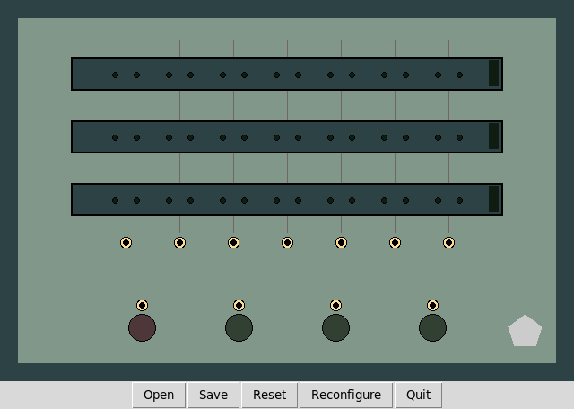
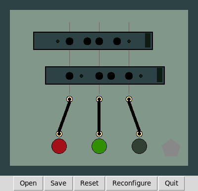

# Jr01 Simulator

This is a simulator for the Jr01 computer. The Jr01 computer was created in 1972 by Honeywell-Bull. For more information, see my [blog post]( https://medium.com/@jberkenbilt/jr01-2e6a42b6cc92).

# Running the Simulator

The simulator just requires Python3 with Tkinter. To run it, just start the `jr01` program.

The three dark rows with holes in them are switches. You can slide the switch to the left or right by dragging the handle on the right edge of the switch.

The black dots are sockets. You can place a peg in a socket or remove the peg from the socket by clicking on the dot.

The gold-colored circles are also sockets. You can run a patch cord from one socket on the top row to a socket on the bottom row by clicking and dragging. You can click on a patch cord to remove it or to change what it is connected to.

The colored circles are lights. The gray pentagon is a button.

A program consists of a combination of peg and patch cord positions. The inputs are the positions of three three switches. By moving the switches, you align the the left or right pegs with the center of each column. If there is a peg in each socket that is aligned with the center of a column, the socket at the base of the column is hot. If there is a patch cord from the base of that column to a light, the light turns on when you press the button.

Here's a little program with two rows, three columns, and three lights. You can see that the button is pressed and the lights are on based on the positions of the pegs relative to the column centers.

Use the buttons at the bottom of the window to load and save programs and to reconfigure the numbers of rows, columns, and lights. The `trivial.jr01` program is a little 4×4×4 configuration where each switch operates a single light. The `counter.jr01` program is a 1 to 8 counter. That's a little bit of a challenge, so maybe you should try it yourself before you load it up.
